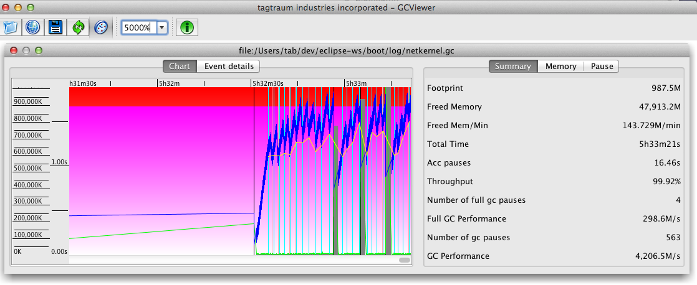

# GCViewer

GCViewer is a little tool that visualizes verbose GC output generated by Sun / Oracle, IBM, HP and BEA Java Virtual Machines. 

**Github网址**

[https://github.com/chewiebug/GCViewer](https://github.com/chewiebug/GCViewer)

